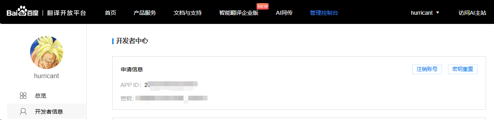
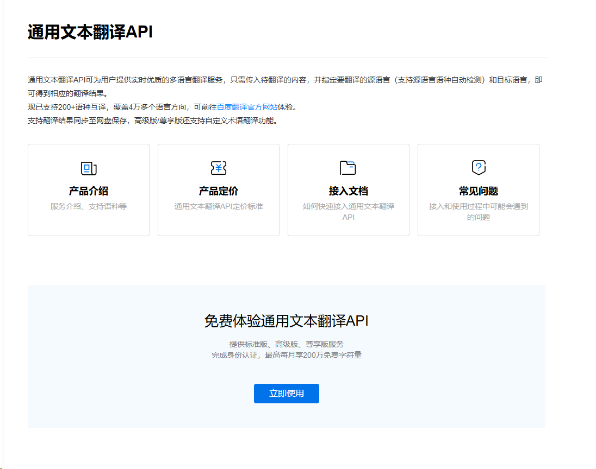
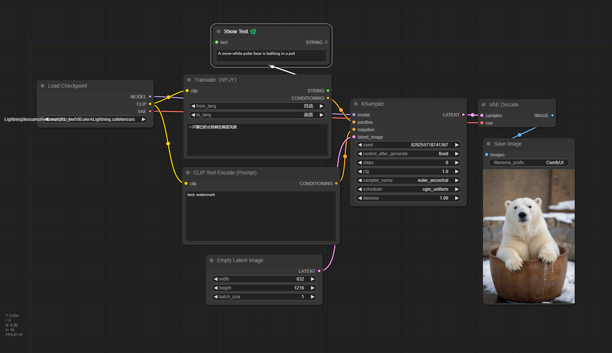
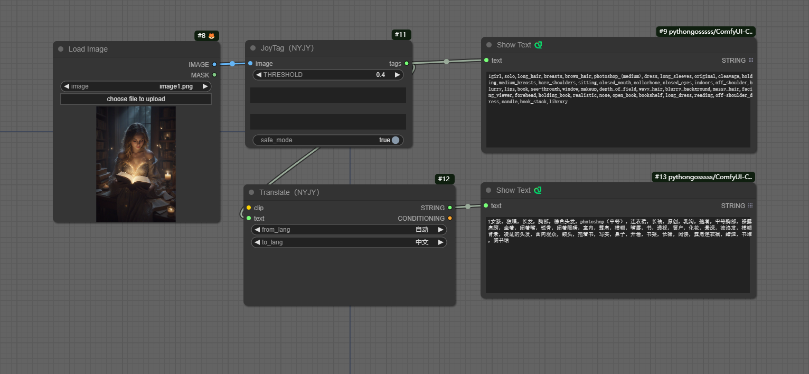

# ComfyUI_NYJY
## 更新日志
### 2024-08-14
- 解决了模型重复下载问题
- joytag增加了安全模式和自定义tag
- 修复了百度翻译中对于带下划线的词无法翻译的问题

（感谢艾威大师兄提出的修改建议）

## 节点列表
### Translate -- 翻译节点，基于百度翻译接口，支持多语言
### JoyTag -- 图片转tags

## 使用方法
### 1. Translate
#### 1.1 修改配置
修根目录下config.josn的内容（如果没有config.json，则手动创建一个），路径为：ComfyUI_NYJY
```
{
    "Baidu": {
        "AppId": "百度翻译平台的APPID",
        "Secret": "百度翻译平台的秘钥"
    }
}
```

#### 1.2 获取百度翻译平台的APPID和秘钥
(1) 登录百度翻译平台[ https://api.fanyi.baidu.com/manage/developer ]，在开发者中心可以获得个人的APPID和秘钥。


(2) 访问[ https://api.fanyi.baidu.com/product/11 ]，开通“通用文本翻译API”。


#### 1.3 工作流示例（图片含工作流）


### 2. JoyTag
#### 2.1 JoyTag基本信息
原项目github地址：https://github.com/fpgaminer/joytag

该插件运行时会自动下载所需的模型，下载模型的所有相关文件将存放到：[comfyui根目录]/costom_nodes/ComfyUI_NYJY/models/joytag中。

如果使用手动下载，需要自己创建目录。模型下载地址：https://huggingface.co/fancyfeast/joytag/tree/main （model.onnx文件可以不用下载）

#### 2.2 节点参数说明

THRESHOLD：浮点类型，范围 0.1 - 1，值越小，产生的tag数量越多。

正面提示词：在完成分析图片之后，额外自定义添加到tag列表的词或句子

负面提示词：在完成缝隙图片之后，需要过滤掉的tag

safe_mode：安全模式，自动过滤tag中血腥、色情等提示词（词库逐步完善中）

#### 2.3 工作流示例（图片含工作流）


感谢WARIO WORLD提供的图片


