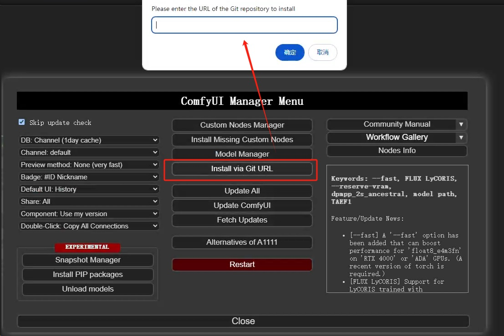
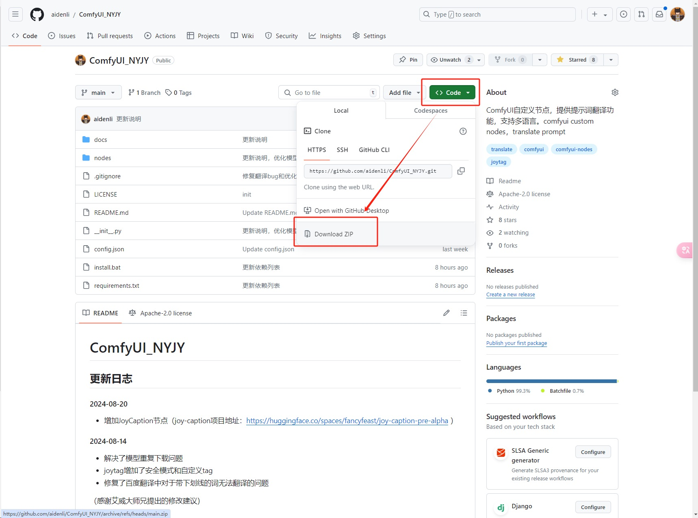

## 关于有朋友反馈插件更新后配置文件的内容会被覆盖的解决方案
### 1. 备份原有的config.json文件
### 2. 删除config.json
### 3. git更新ComfyUI_NYJY
### 4. 把备份好的config.json文件放回项目根目录
### （上述操作只需要做一次，完成最近的更新即可，后续就可以正常更新了）

## 更新日志
#### 2025-03-16 接入阿里百炼平台（文本推理、图片理解能力），增加了一些针对json和数组的方法。百炼api-key申请地址：[https://bailian.console.aliyun.com/?apiKey=1#/api-key](https://bailian.console.aliyun.com/?apiKey=1#/api-key) 

[查看百炼节点的demo](docs/images/百炼demo.png)

[全部更新历史](docs/update_log.md)

## 节点列表
#### [Translate -- 翻译节点，对接谷歌翻译和百度翻译，支持多语言。（重要：百度翻译节点配置详细说明）](docs/translate.md)

#### [JoyTag -- 反推图片，输出tags。（点击查看详细）](docs/joytag.md)

#### [JoyCaption -- 反推图片，输出自然语言。（点击查看详细）](docs/joycaption.md)

#### [CivitaiPrompt -- 随机获取C站图片的提示词。（点击查看详细）](docs/civitaiprompt.md)

## 安装方法（两种方式）
### 1. 通过ComfyUI Manager安装。

打开ComfyUI Manager，点击“Install via Git URL”按钮

在弹出的对话框中填入：https://github.com/aidenli/ComfyUI_NYJY

### 2. 手动拷贝
访问项目地址：https://github.com/aidenli/ComfyUI_NYJY
点击Code按钮，在弹出的浮层中点击“Download ZIP”。下载后解压到 [你的ConmfyUI目录]/custom_nodes/

