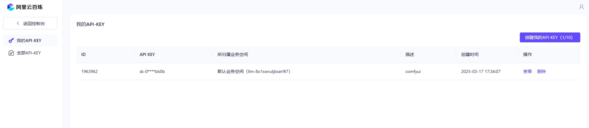
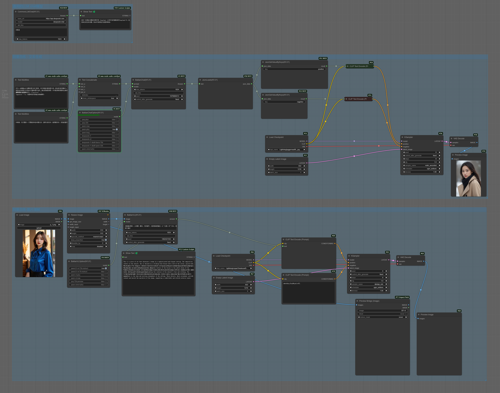

### 阿里百炼平台节点
1. BailianChat -- 文本推理节点
2. BailianVL -- 文本推理模型列表节点
3. BailianChatOption -- 图片推理节点
4. BailianVLOption -- 图片推理模型列表节点
<br />
<br />

### api key获取方式
登录：[https://bailian.console.aliyun.com/?apiKey=1](https://bailian.console.aliyun.com/?apiKey=1)。没有账户就注册一个，注册后会获得一些模型的使用额度，具体额度值可以在模型广场中查看。



将创建的api key写入到config.json文件中，如果config.json不存在，可以拷贝config.json.template的内容新建一个。

修改文件中的bailian.api_key：
```json
    {
    "Baidu": {
        "AppId": "APPID",
        "Secret": "SECRET"
    },
    "Google": {"proxy": ""}, 
    "DeepSeek": {
        "api_key": ""
    },
    "bailian": {
        "api_key": "阿里百炼平台的key写在这里"
    },
    "volcengine": {
        "api_key": ""
    }
}
```
<br />
<br />

### 使用demo（图片带流）
注意：挂梯子有可能会导致阿里百炼的api请求失败。
<br />

