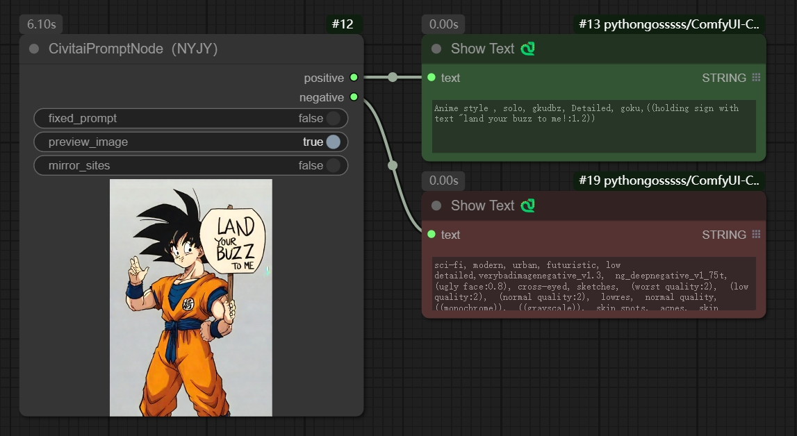

### 节点详细说明

随机获取C站图片的提示词，以及预览图片，帮助用户寻找灵感

#### 1 参数说明

fixed_prompt：打开选项时获取图片后下次运行不再获取其他图片，便于保持该图片关键词，调整其他参数；关闭选项每次运行都会切换新的图片。

preview_image：预览随机选取到的图片

mirror_sites：关闭时，从civitai.com获取数据；开始时，从civitai.work获取数据

[**重要**]个人测试感觉：civitai.work站点延时较高，如果能科学上网，建议关闭mirror_sites选项。如果不能科学上网，建议关闭preview_image选项，便于提高速度。如果发现执行后无任何内容返回，一般是因为接口返回超时了，尝试重新执行。