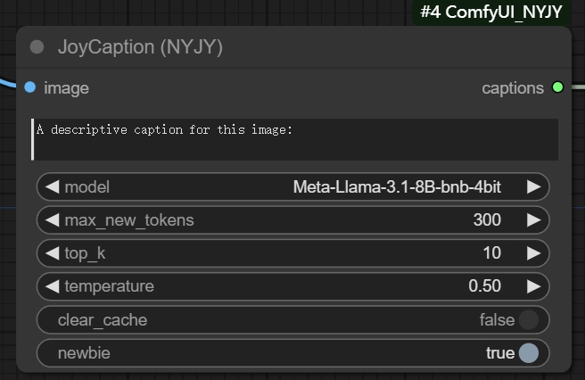
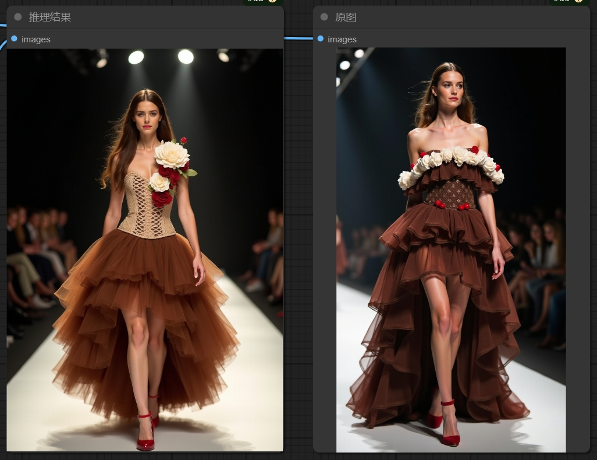

### 使用说明
#### 1 JoyCaption基本信息
原项目地址：https://huggingface.co/spaces/fancyfeast/joy-caption-pre-alpha

插件运行时会自动下载两个模型，也可以手动下载放到对应路径中：

- CLIP模型：[google/siglip-so400m-patch14-384]( https://huggingface.co/google/siglip-so400m-patch14-384/tree/main )，下载后将存放到此路径：[comfyui_project]/models/clip/siglip-so400m-patch14-384

- 大语言模型：[unsloth/Meta-Llama-3.1-8B-bnb-4bit]( https://huggingface.co/unsloth/Meta-Llama-3.1-8B-bnb-4bit/tree/main )，下载后将存放到此路径：[comfyui_project]/models/llm/Meta-Llama-3.1-8B-bnb-4bit

注意：必须下载整个目录的所有文件，不要只下载model.safetensors

访问外网有困难的朋友可以通过夸克网盘下载：https://pan.quark.cn/s/e2a52f2a5bae

#### 2 节点参数说明

image：需要反推的图片。

提示词：用于指定需要提取图片的何种特征，没有特别需求的情况下此字段无需修改。

model：大语言模型，目前只有一个选项，无需修改

max_new_tokens：反推生成的最大token数量

top_k：无特殊需求可以不修改

temperature：无特殊需求可以不修改

clear_cache：运行该插件需要加载大语言模型和CLIP模型，在我的4090显卡上测试大概需要9-10G的显存。对于显存比较吃紧的用户，可以打开此选项，作用是在每次推理图片结束后，回收加载模型时占用的缓存，这是一种用时间换空间的权宜之计，副作用是每次推理都需要重新加载大语言模型和CLIP模型，整体运行时间变长。

#### 3 工作流示例（图片含工作流）

